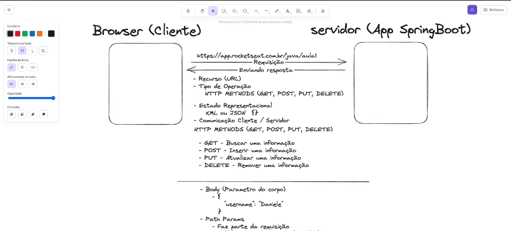

# 📚 Anotações - Fundamentos Spring Boot

## 🔸 Annotations (@)

Annotations (@) são recursos do Java utilizados para fornecer informações adicionais ao código. No Spring Boot, as annotations são amplamente usadas para configurar, definir comportamentos e facilitar a integração entre componentes do framework.

### Principais características

- Permitem marcar classes como controladores REST (`@RestController`)
- Definem métodos que respondem a requisições HTTP (`@GetMapping`, `@PostMapping`)
- Injetam dependências automaticamente (`@Autowired`)
- Configuram beans (`@Bean`)

> 💡 **Vantagem:** O uso de annotations torna o código mais limpo, reduz a necessidade de configurações externas e facilita o desenvolvimento de aplicações Spring Boot.

---



---

## 🎯 Controllers

### **O que é um Controller e para que serve?**

Um *controller* (ou controlador) é uma classe responsável por receber e processar as requisições feitas à aplicação, geralmente vindas de um navegador ou de outro sistema. No contexto do Spring Boot, os controllers são usados para definir os pontos de entrada da aplicação, ou seja, os caminhos (endpoints) que podem ser acessados via HTTP.

#### 🔄 Como funciona

1. **Recebe requisições** do cliente (usuário ou sistema)
2. **Interpreta os dados** recebidos
3. **Chama os serviços** necessários para processar a informação
4. **Retorna uma resposta** adequada ao cliente

#### 📋 Exemplo prático

Ao acessar um endereço como `/usuarios`, o controller pode buscar uma lista de usuários no banco de dados e devolver essa lista em formato JSON.

> ⚙️ **Importante:** No Spring Boot, os controllers geralmente são marcados com a annotation `@RestController`, indicando que aquela classe irá tratar requisições REST e retornar dados diretamente no corpo da resposta.

---

## 🌐 Parâmetros de URL

### **O que são Path Param e Query Param? Qual a diferença?**

#### 🛤️ **Path Param** (Parâmetro de caminho)

- **Definição:** Valor inserido diretamente na URL para identificar um recurso específico
- **Exemplo:** Em `/usuarios/123`, o `123` é um path param que geralmente representa o ID de um usuário
- **Spring Boot:** Acesse usando `@PathVariable`

#### ❓ **Query Param** (Parâmetro de consulta)

- **Definição:** Valor passado após o símbolo `?` na URL, usado para filtrar ou modificar a resposta
- **Exemplo:** Em `/usuarios?idade=25`, `idade=25` é um query param
- **Spring Boot:** Acesse usando `@RequestParam`

#### 📊 **Resumo da diferença**

| Tipo | Propósito | Localização na URL | Uso típico |
|------|-----------|-------------------|------------|
| **Path Param** | Identificar recursos únicos | Parte do caminho | IDs, identificadores específicos |
| **Query Param** | Informações adicionais | Após o `?` | Filtros, opções de busca |

## 🏗️ IoC e Injeção de Dependência no Spring Boot

### O que é IoC (Inversão de Controle)?

**Inversão de Controle (IoC)** é um princípio de design onde o controle da criação e gerenciamento dos objetos é transferido do próprio código para um container ou framework. No caso do Spring Boot, o próprio framework é responsável por instanciar, configurar e gerenciar o ciclo de vida dos objetos (beans).

- **Sem IoC:** Você mesmo instancia e gerencia as dependências das classes.
- **Com IoC:** O Spring gerencia as dependências e entrega os objetos prontos para uso.

### O que é Injeção de Dependência?

**Injeção de Dependência (DI)** é uma forma prática de implementar IoC. Com DI, as dependências de uma classe (ou seja, os objetos dos quais ela precisa) são fornecidas automaticamente pelo framework, em vez de serem criadas manualmente dentro da própria classe.

#### Exemplo prático

```java
// Sem injeção de dependência
public class UsuarioService {
    private UsuarioRepository repo = new UsuarioRepository();
}

// Com injeção de dependência (Spring Boot)
@Service
public class UsuarioService {
    private final UsuarioRepository repo;

    @Autowired
    public UsuarioService(UsuarioRepository repo) {
        this.repo = repo;
    }
}
```

No exemplo acima, o Spring Boot injeta automaticamente uma instância de `UsuarioRepository` na classe `UsuarioService`, facilitando o desenvolvimento, os testes e a manutenção do código.

> 🔑 **Resumo:** IoC é o conceito, e a Injeção de Dependência é a principal forma de implementá-lo no Spring Boot.
